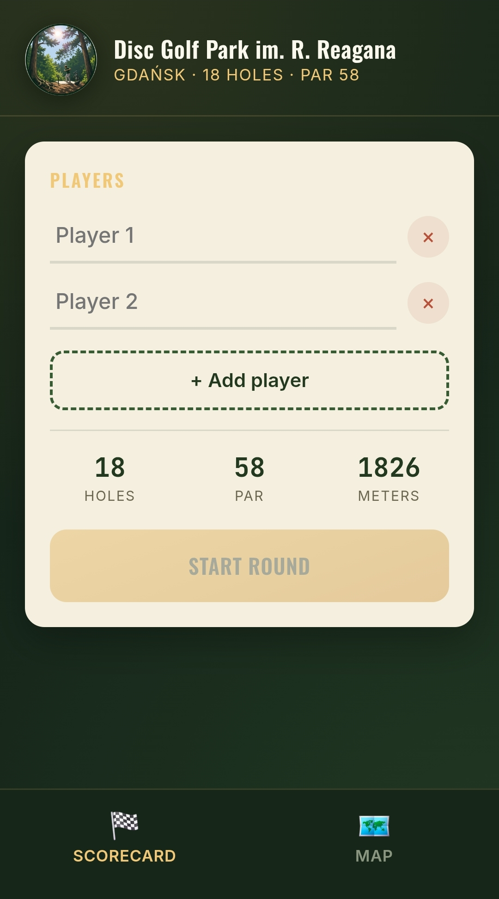
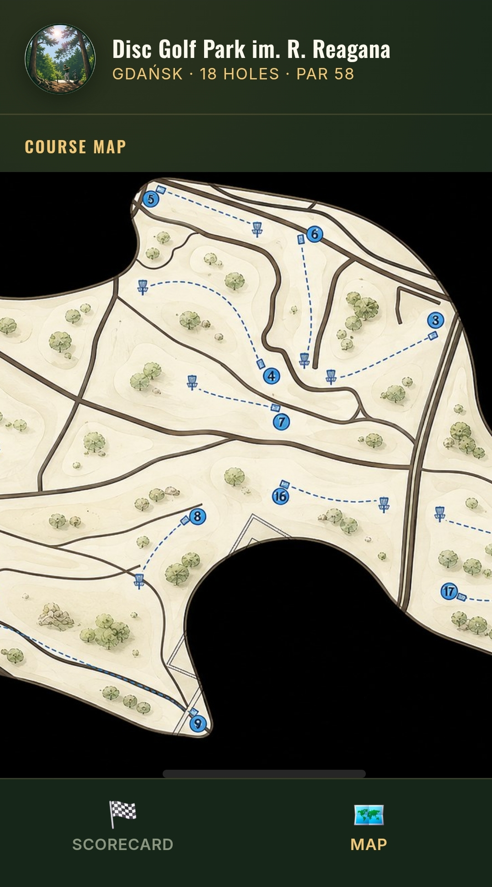
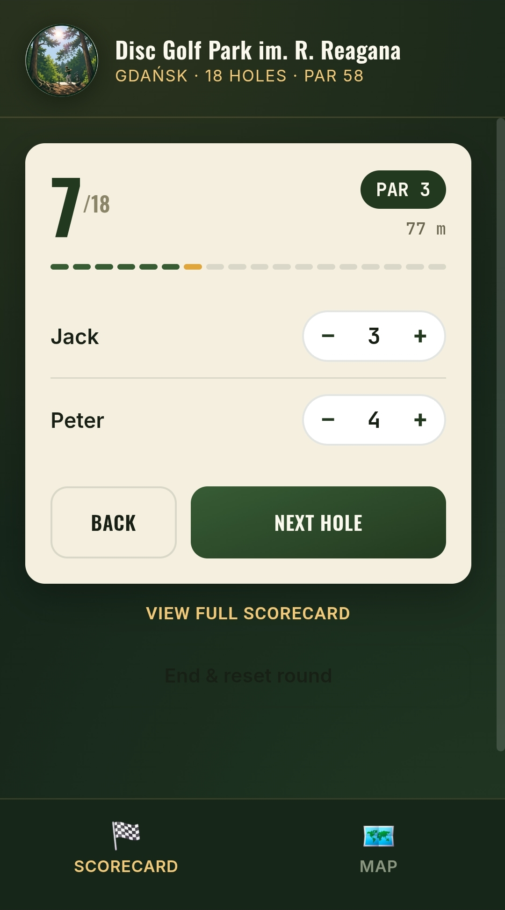
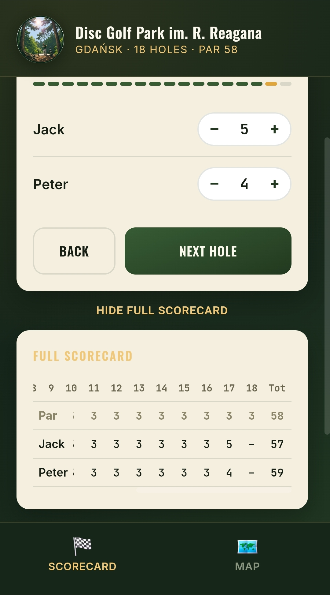
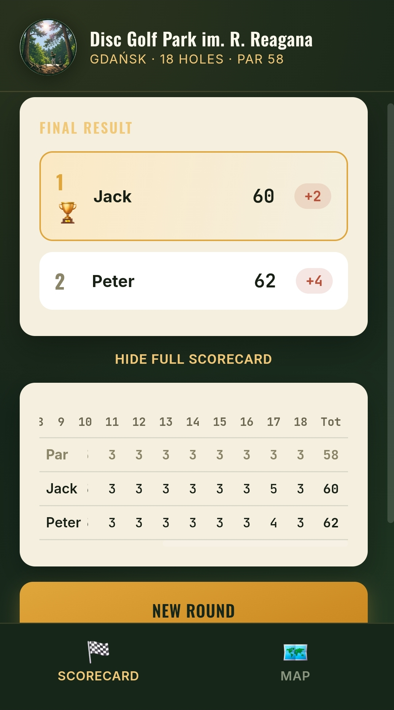

# Reagana DGC Scorecard

A mobile-first scorecard for **Disc Golf Park im. R. Reagana** in Gdańsk — 18 holes, par 58.

## Features

- Hole-by-hole scoring with +/- steppers
- Live leaderboard across players
- Embedded course map tab
- Self-contained single-file app — no build step, no server, no dependencies. Open `index.html` and go.

## Demo

| Setup | Course map | Scoring | Full scorecard | Results |
|---|---|---|---|---|
|  |  |  |  |  |

## Usage

**Easiest — use it live, no download needed:**
Open [nieczuje.github.io/disc-golf-scorecard](https://nieczuje.github.io/disc-golf-scorecard/) in your phone's browser. For a home-screen "app" feel, use "Add to Home Screen" from the browser menu.

**Offline / standalone copy:**
Download `index.html` from this repo and open it directly in a browser — the whole app is self-contained in that one file, so it works without internet access once downloaded.

## Tech

Vanilla HTML/CSS/JS. All assets (logo, course map) are base64-embedded directly in the HTML, so the whole app is one file you can drop anywhere — no CDN, no build pipeline required to *run* it.

## Notes

- Course logo and map images are inlined as base64 to keep the app a single portable file.
